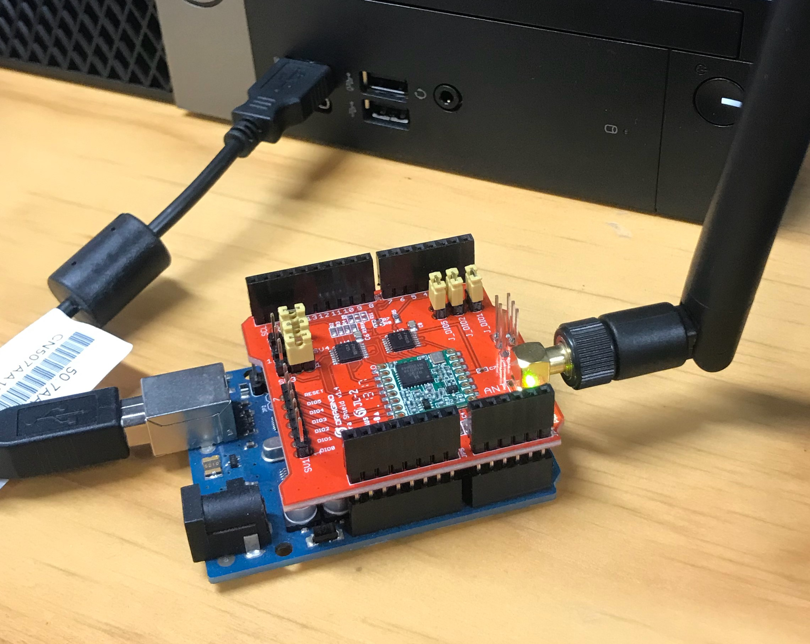
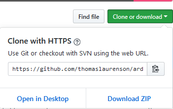
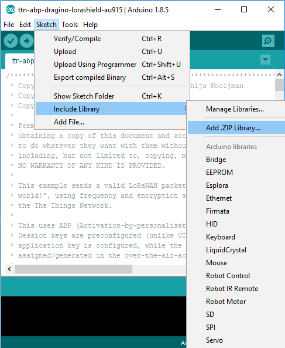
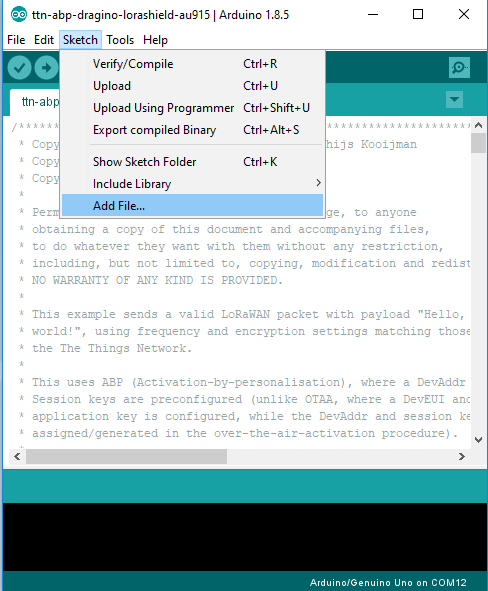
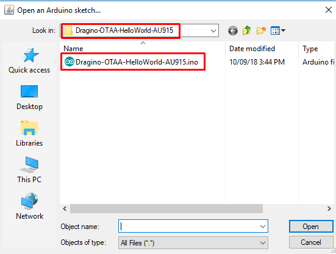
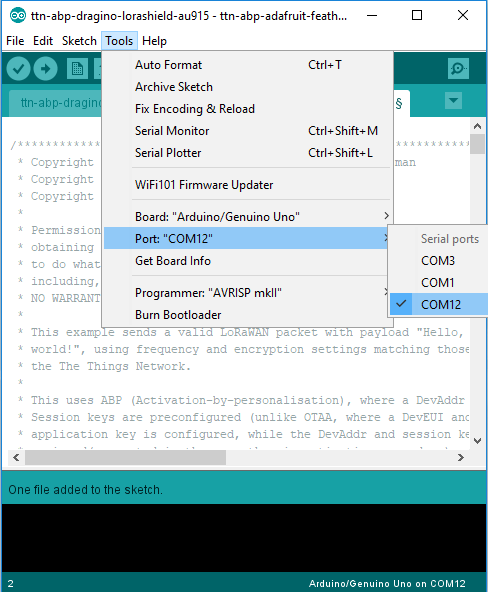
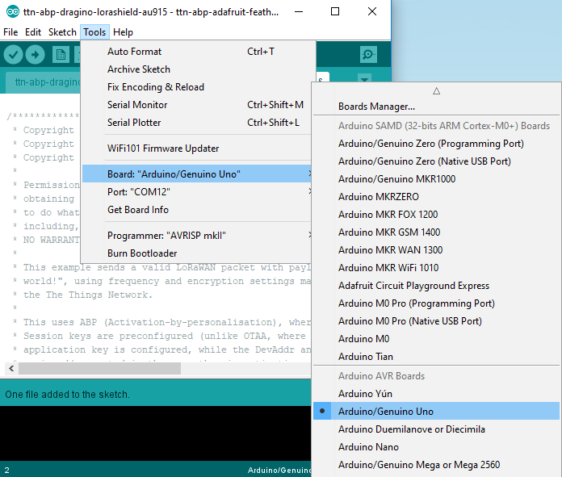
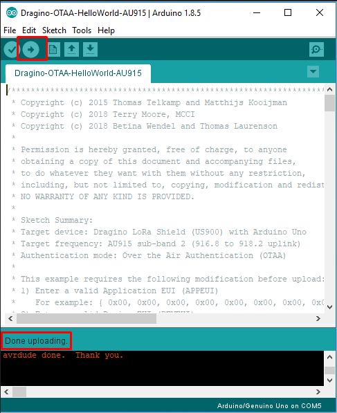
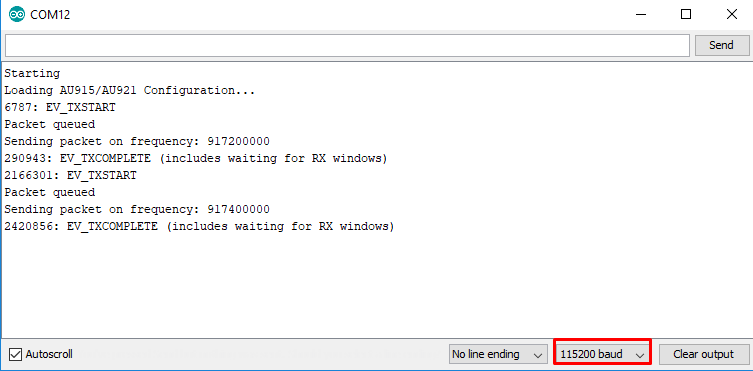
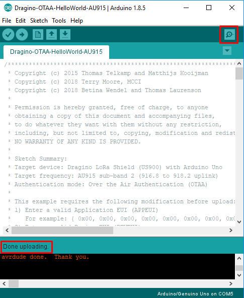

# Dragino-OTAA-HelloWorld-AU915

### Configuring a Dragino LoRa Shield for use on the AU915 frequency using OTAA

<br />

<br />

## Preparation

- Download and install the Arduino IDE.

Make sure you have version 1.6.6 (or above) of the Arduino IDE. The documentation for the MCCI Arduino-LMIC library state that this version is required because it requires C99 mode to be enabled by default.

## Required hardware

- Dragino LoRa Shield AU915
- Arduino Uno board
- Antenna

## Download the Arduino-LMIC library

- Open a web browser and navigate to the [MCCI Arduino-LMIC library](https://github.com/thomaslaurenson/arduino-lmic) repository
- Click on the _Clone or Download_ button
- Select _Download ZIP_

<br />

<br />

## Add the MCCI Arduino-LMIC library to the _libraries_ directory of your Arduino IDE installation

- Open Arduino IDE
- Navigate to _Sketch_, _Include Library_, _Add .ZIP Library_
- Find the ZIP file, and select Open

<br />

<br />

## Adding the Example Sketch 

- Add the provided sketch for the Dragino LoRa Shield from the `code` directory from this repository into the Arduino Sketchbook folder. 

<br />

<br />

The example sketch is provided in the `code` directory. The sketch is named:

<br />

```
Dragino-OTAA-HelloWorld-AU915.ino
```
<br />

- Make sure to put the sketch (`.ino` file) into a folder with the same name.

<br />

<br />

- Open the sketch
- Set the OTAA Keys

Make sure you remember to **change the OTAA properties in the sketch file**. You need to replace the `FILLMEIN` placeholders with a valid Application EUI (APPEUI), Device EUI (DEVEUI) and Application Key (APPKEY). The block of code is displayed for reference below.

<br />

```
// This EUI must be in little-endian format, so least-significant-byte
// first. When copying an EUI from ttnctl output, this means to reverse
// the bytes. For TTN issued EUIs the last bytes should be 0xD5, 0xB3,
// 0x70.
static const u1_t PROGMEM APPEUI[8]= { FILLMEIN };
void os_getArtEui (u1_t* buf) { memcpy_P(buf, APPEUI, 8);}

// This should also be in little endian format, see above.
static const u1_t PROGMEM DEVEUI[8]= { FILLMEIN };
void os_getDevEui (u1_t* buf) { memcpy_P(buf, DEVEUI, 8);}

// This key should be in big endian format (or, since it is not really a
// number but a block of memory, endianness does not really apply). In
// practice, a key taken from the TTN console can be copied as-is.
static const u1_t PROGMEM APPKEY[16] = { FILLMEIN };
void os_getDevKey (u1_t* buf) {  memcpy_P(buf, APPKEY, 16);}
```
<br />

Also, make sure to write it in little endian format for the first two keys.
For example, if the key is `1122334455667788`:

`1122334455667788` - > `8877665544332211` -> `0x88, 0x77, 0x66, 0x55, 0x44, 0x33, 0x22, 0x11`

- Change the COM port to the attached device

<br />

<br />

- Select the board of the attached device

<br />

<br />

- The sketch is ready to be compiled and uploaded by clicking on _Upload_. Then wait until it shows _Done uploading_ at the bottom

<br />

<br />

## Checking Functionality

- Make sure you have the correct COM port selected
- Make sure you have the right board selected
- Check if the Serial Monitor is set to `152000`

<br />

<br />

- Click on _Serial Monitor_ when _Done uploading_ is shown at the bottom

<br />

<br />

- You should see output similar to the listing below:


<br />

```
Starting
Loading AU915/AU921 Configuration...
Packet queued
Sending packet on frequency: 0
1893: EV_JOINING
3295: EV_TXSTART
539542: EV_TXSTART
855083: EV_JOINED
netid: 0
devaddr: 12514E6
artKey: 671D27A7FEC4EC623315B3D62C05BCD
nwkKey: EDAA19E9C07DB7E48BF197D21CC463

Successful OTAA Join...
861403: EV_TXSTART
927655: EV_TXCOMPLETE (includes waiting for RX windows)
1240583: EV_TXSTART
Packet queued
Sending packet on frequency: 917500000
1306175: EV_TXCOMPLETE (includes waiting for RX windows)
1619107: EV_TXSTART
Packet queued
Sending packet on frequency: 917500000
1684636: EV_TXCOMPLETE (includes waiting for RX windows)

```
<br />